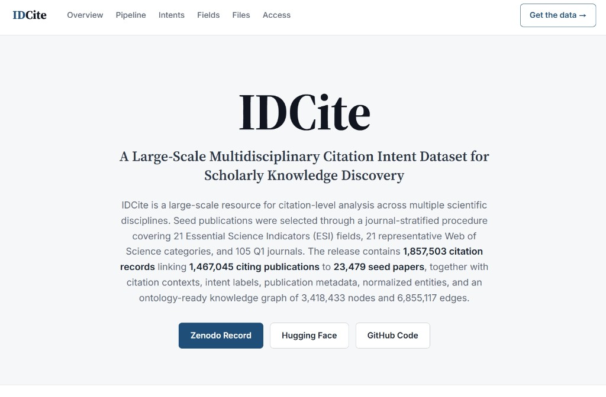

# IDCite 

Project Page for **IDCite: A Large-Scale Multidisciplinary Citation Intent Dataset for Scholarly Knowledge Discovery.**

## Project Page



## Website URL

**https://seohyunnam.github.io/IDCite-Website/**

## Abstract

IDCite is a large-scale resource for citation-level analysis across multiple scientific disciplines. Seed publications were selected through a journal-stratified procedure covering 21 Essential Science Indicators (ESI) fields, 21 representative Web of Science categories, and 105 Q1 journals. The release contains 1,857,503 citation records linking 1,467,045 citing publications to 23,479 seed papers, together with citation contexts, citation-intent labels, publication metadata, normalized scholarly entities, and an ontology-ready knowledge graph of 3,418,433 nodes and 6,855,117 edges.

| Measure | Value |
|---|---|
| Citation events | 1,857,503 |
| Citing papers | 1,467,045 |
| Seed (cited) papers | 23,479 |
| ESI fields | 21 |
| Q1 journals sampled | 105 |
| Data snapshot | November 2025 |

## Public Access

- **Zenodo Record (Version 3):** https://doi.org/10.5281/zenodo.20796923
- **Hugging Face:** https://huggingface.co/datasets/Daniel0315/IDCite
- **Construction pipeline (code):** https://github.com/SeohyunNam/MDCite
- **CitationHub (interactive platform):** https://citation-hub-website.vercel.app
- **CitationHub (public documentation):** https://github.com/SeohyunNam/CitationHub-System

## Repository contents

```
index.html                 Single-page overview
assets/style.css           Styles
assets/main.js             Charts and tables
assets/pipeline_figure.png Construction-workflow figure 
IDCite_Project_and_Dataset_Documentation_Seohyun_Nam.pdf
```


## License

Creative Commons Attribution 4.0 International (CC BY 4.0).

© 2026 Seohyun Nam
